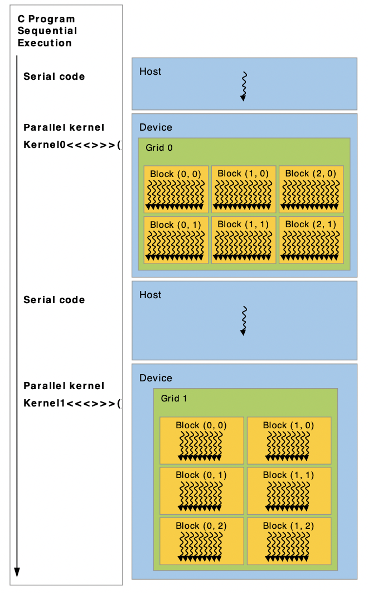
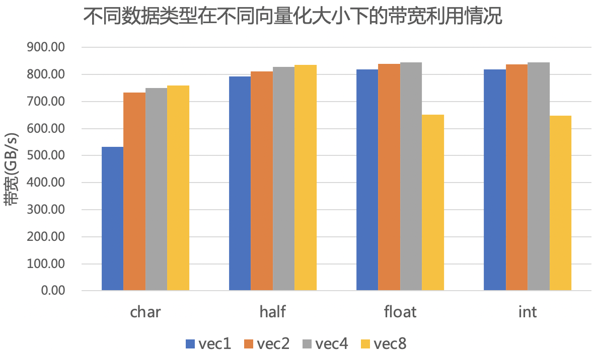
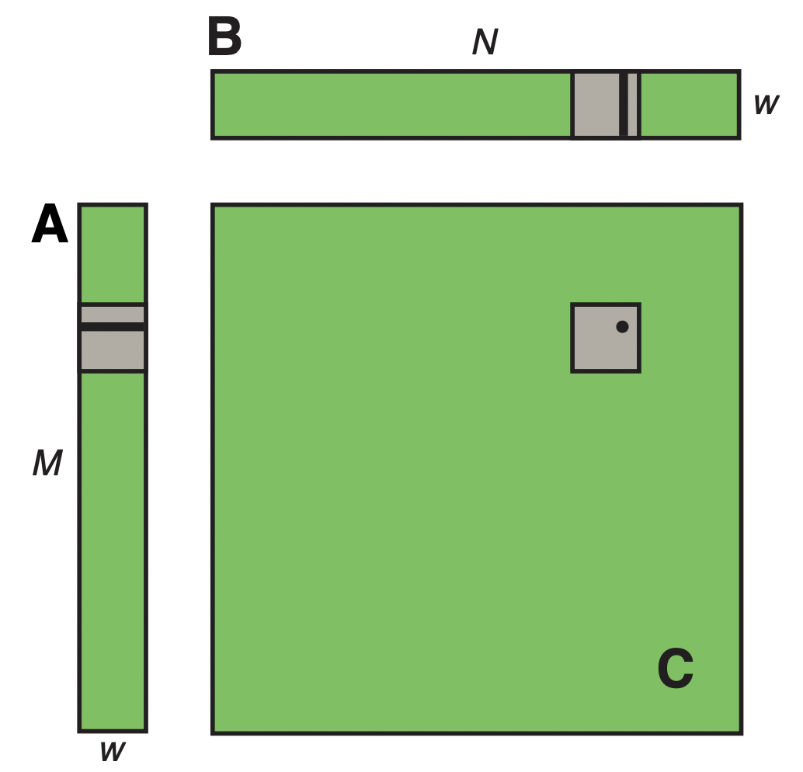
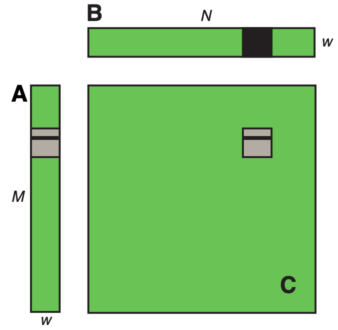
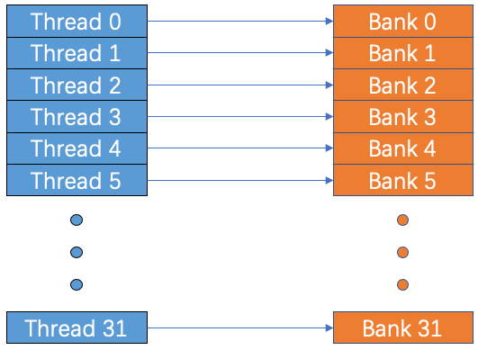
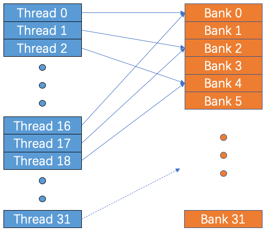
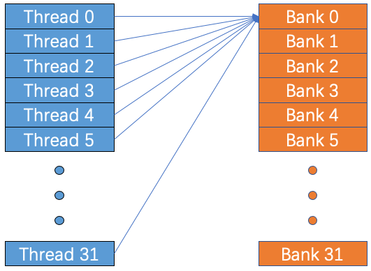
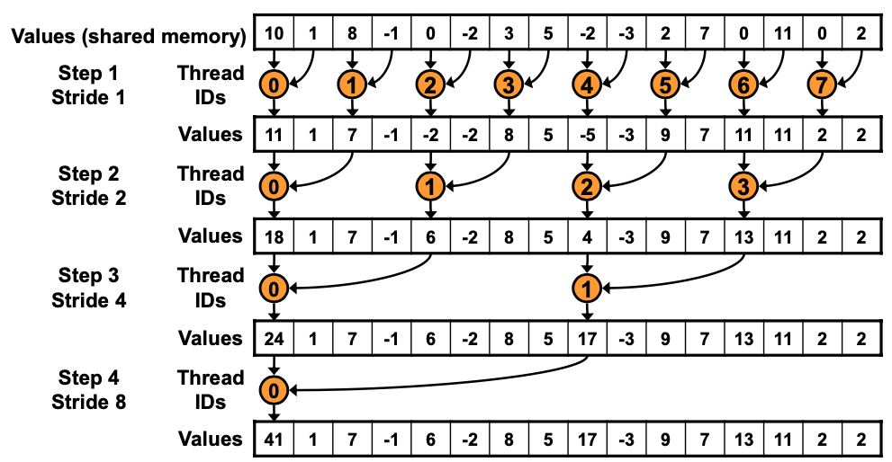
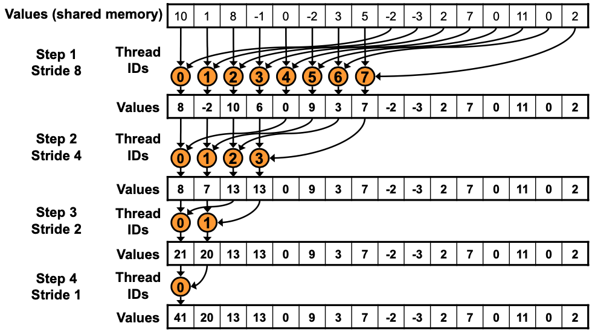

## 3.1 内存 DMA 操作

### 3.1.1 概述

如下图所示，CUDA 编程模型是一种典型的异构编程模型，假设主机和设备都在 DRAM 中维护自己独立的内存空间，分别称为主机内存（host memory）和设备内存（device memory）。 因此，程序在调用 CUDA kernel 时需要管理可见的全局（global）、常量（constant）和纹理（texture）内存空间，这其中就包括设备内存的分配和释放以及主机和设备内存之间的数据传输。 



下图展示了内存结构，每种内存都拥有不同的空间、生命周期和 cache。


对于优化 CUDA 程序性能，也就是最大化程序的整体内存吞吐量的第一步，就是减少低带宽下的数据传输。这也就意味着尽可能地减少 host 和 device 之间的数据传输，因为 host 与 device 之间的带宽比 global memory 和 device 之间低得多。这其中会涉及到 shared memory 和 cache 的使用，在后面几节会详细描述。

本节内容主要针对当 host 与 device 之间的数据传输量固定时，如何更加高效地进行传输。

### 3.1.2 代码示例

线性的内存通常使用 `cudaMalloc()` 分配并使用 `cudaFree()` 释放，主机内存和设备内存之间的数据传输通常使用 `cudaMemcpy()` 完成。线性内存也可以通过 `cudaMallocPitch()` 和 `cudaMalloc3D()` 分配。 对于二维和三维数组的内存分配，建议使用`cudaMallocPitch()` 和 `cudaMalloc3D()` ，因为这两个函数可以保证在分配内存时进行适当的补齐，从而满足 DMA 中对于内存地址的对齐要求。

一个简单的例子就是在进行矩阵乘的时候，这里为了简化，用正方形的矩阵乘说明，代码如下：

```
#define N 1000
#define BLOCK 256

__global__ void Matmul(float *a, float *b, float *c) {
  int row = threadIdx.y + blockIdx.y * blockDim.y;
  int col = threadIdx.x + blockIdx.x * blockDim.x;
  float sum = 0.0f;
  if (row < N && col < N) {
    for (int i = 0; i < N; ++i) {
      sum += a[row * N + i] * b[i * N + col];
    }
    c[row * N + col] = sum;
  }
}

// 分配 host 内存并初始化数据
...

// 分配 device 内存
float *d_a, *d_b, *d_c;
cudaMalloc((void **)&d_a, N * N * sizeof(float));
cudaMalloc((void **)&d_b, N * N * sizeof(float));
cudaMalloc((void **)&d_c, N * N * sizeof(float));

// 从 host 拷贝数据到 device 端
cudaMemcpy((void *)d_a, (void *)a, N * N * sizeof(float),
           cudaMemcpyHostToDevice);
cudaMemcpy((void *)d_b, (void *)b, N * N * sizeof(float),
           cudaMemcpyHostToDevice);
           
dim3 blockSize(BLOCK);
dim3 gridSize(N * (N + BLOCK - 1) / BLOCK);
Matmul<<<gridSize, blockSize>>>(d_a, d_b, d_c);

// 将结果从 device 拷回 host
cudaMemcpy((void *)c, (void *)d_c, N * N * sizeof(float),
            cudaMemcpyDeviceToHost);
```

使用`cudaMallocPitch()`和`cudaMemcpy2D()`后，代码改写如下（省去重复部分）：

```
__global__ void Matmul_2d(float *a, float *b, float *c, size_t pitch_a,
                               size_t pitch_b, size_t pitch_c) {
  int tid = threadIdx.x + blockIdx.x * blockDim.x;
  int row = tid / N;
  int col = tid % N;
  float sum = 0.0f;
  if (row < N && col < N) {
    for (int i = 0; i < N; ++i) {
      sum += a[row * pitch_a / sizeof(float) + i] *
             b[i * pitch_b / sizeof(float) + col];
    }
    c[row * pitch_c / sizeof(float) + col] = sum;
  }
}

...
float *d_a, *d_b, *d_c;
size_t pitch_a, pitch_b, pitch_c;
cudaMallocPitch((void **)&d_a, &pitch_a, N * sizeof(float), N);
cudaMallocPitch((void **)&d_b, &pitch_b, N * sizeof(float), N);
cudaMallocPitch((void **)&d_c, &pitch_c, N * sizeof(float), N);

cudaMemcpy2D((void *)d_a, pitch_a, (void *)a, N * sizeof(float),
             N * sizeof(float), N, cudaMemcpyHostToDevice);
cudaMemcpy2D((void *)d_b, pitch_b, (void *)b, N * sizeof(float),
             N * sizeof(float), N, cudaMemcpyHostToDevice);
...         
Matmul_2d<<<gridSize, blockSize>>>(d_a, d_b, d_c, pitch_a, pitch_b,
                                   pitch_c);
cudaMemcpy2D((void *)c, N * sizeof(float), (void *)d_c, pitch_c,
             N * sizeof(float), N, cudaMemcpyDeviceToHost);
```

### 3.1.3 性能分析

以上两种写法的性能数据如下：

```
Matmul time: 1.562906 ms
Matmul_2d time: 1.299914 ms
```

出现这样的性能差异的原因，就是因为只有当 global memory 的地址对齐（32、64、128 字节对齐）时，device 的读取效率才是最高的，因为只有这样在一个 warp 中的访存才可以完全合并。在此例中，由于矩阵是 1000x1000，所以不同行的地址起点并不是对齐的，因此造成了性能下降。`cudaMallocPitch()` 函数以及相关的内存复制函数，如`cudaMemcpy2D`使程序员能够更自由地编写代码来分配符合这些约束的内存，而无需过度关注硬件。 

## 3.2 向量化

### 3.2.1 概述

CUDA kernel 通常被划分为两类：compute-bound 和 memory-bound。顾名思义，前者的性能瓶颈是计算瓶颈，主要受硬件算力所限制；而后者则是访存瓶颈，受带宽限制。在当前硬件架构不断更新，算力不断提高的情况下，算力与带宽的差距越来越大，造成了越来越多的 kernel 性能因带宽限制而受限，即 memory-bound。

本节所介绍的向量化访存是 CUDA 中常用的可以有效提升带宽利用率的方法，同时向量化访存还可以减少执行指令的数量，而使 memory-bound kernel 性能得到提升。

### 3.2.2 代码示例

我们以一个简单的 add 来描述从标量到向量化的过程。

```c
#define N 1<<20

__global__ void add_scalar(float *x, float *y, float *z, int n) {
  int index = threadIdx.x + blockIdx.x * blockDim.x;
  int stride = blockDim.x * gridDim.x;
  for (int i = index; i < n; i += stride) {
    z[i] = x[i] + y[i];
  }
}

...
int blockSize = 512;
int gridSize = (N + blockSize - 1) / blockSize;
add_scalar<<<gridSize / vector_num, blockSize>>>(x, y, z, N);
...
```

首先是一个最初的标量版本，这里主要展示 device 的代码，host 端代码亿省略。我们可以通过 cuobjdump 来查看编译好的可执行文件的汇编指令，命令如下：

```
cuobjdump -sass 可执行文件
```

得到 kernel 的部分 SASS 指令如下：

```
/*0048*/                   MOV32I R7, 0x4;                              /* 0x180000001001dde2 */
/*0050*/                   MOV R9, c[0x0][0x34];                        /* 0x28004000d0025de4 */
/*0058*/                   IMAD.HI.X R5, R0, R7, c[0x0][0x144];         /* 0x208e800510015ce3 */
/*0060*/                   ISCADD R2.CC, R0, c[0x0][0x148], 0x2;        /* 0x4001400520009c43 */
/*0068*/                   LD.E R4, [R4];                               /* 0x8400000000411c85 */
/*0070*/                   IMAD.HI.X R3, R0, R7, c[0x0][0x14c];         /* 0x208e80053000dce3 */
/*0078*/                   LD.E R2, [R2];                               /* 0x8400000000209c85 */
                                                                        /* 0x22e04283f28232c7 */
/*0088*/                   ISCADD R6.CC, R0, c[0x0][0x150], 0x2;        /* 0x4001400540019c43 */
/*0090*/                   IMAD.HI.X R7, R0, R7, c[0x0][0x154];         /* 0x208e80055001dce3 */
/*0098*/                   IMAD R0, R9, c[0x0][0x28], R0;               /* 0x20004000a0901ca3 */
/*00a0*/                   ISETP.GE.AND P0, PT, R0, c[0x0][0x158], PT;  /* 0x1b0e40056001dc23 */
/*00a8*/                   FADD R8, R2, R4;                             /* 0x5000000010221c00 */
/*00b0*/                   ST.E [R6], R8;                               /* 0x9400000000621c85 */
```

其中 LD.E 与 ST.E 是负责访存的指令，分别代表了从全局内存中 load 和 store 32 位数据。我们可以通过使用向量化加载和存储指令 LD.E.{64,128} 和 ST.E.{64,128} 来提高此操作的性能。这些操作也会加载和存储数据，但是以 64 或 128 的位宽进行。 使用向量化加载可减少指令总数、减少延迟并提高带宽利用率。 

想要使用这些向量化指令，我们需要改写 kernel，以下代码分别是向量化长度为 2 和 4 时的 add kernel：

```c
// 向量化长度=2
__global__ void add_vector2(float *x, float *y, float *z, int n) {
  int index = threadIdx.x + blockIdx.x * blockDim.x;
  int stride = blockDim.x * gridDim.x;
  float2 x_tmp, y_tmp, z_tmp;
  for (int i = index; i < n / 2; i += stride) {
    x_tmp = reinterpret_cast<float2 *>(x)[i];
    y_tmp = reinterpret_cast<float2 *>(y)[i];
    z_tmp.x = x_tmp.x + y_tmp.x;
    z_tmp.y = x_tmp.y + y_tmp.y;
    reinterpret_cast<float2 *>(z)[i] = z_tmp;
  }
}

// 向量化长度=4
__global__ void add_vector4(float *x, float *y, float *z, int n) {
  int index = threadIdx.x + blockIdx.x * blockDim.x;
  int stride = blockDim.x * gridDim.x;
  float4 x_tmp, y_tmp, z_tmp;
  for (int i = index; i < n / 4; i += stride) {
    x_tmp = reinterpret_cast<float4 *>(x)[i];
    y_tmp = reinterpret_cast<float4 *>(y)[i];
    z_tmp.x = x_tmp.x + y_tmp.x;
    z_tmp.y = x_tmp.y + y_tmp.y;
    z_tmp.z = x_tmp.z + y_tmp.z;
    z_tmp.w = x_tmp.w + y_tmp.w;
    reinterpret_cast<float4 *>(z)[i] = z_tmp;
  }
}
```

为了验证向量化指令是否真的生效，我们还是查看一下其分别对应的 SASS 指令，如下：

```
/*0088*/                   LD.E.64 R2, [R6];                           /* 0x8400000000609ca5 */
/*0090*/                   IMAD.HI.X R5, R0, R11, c[0x0][0x14c];       /* 0x2096800530015ce3 */
/*0098*/                   LD.E.64 R4, [R4];                           /* 0x8400000000411ca5 */
/*00a0*/                   ISCADD R12.CC, R0, c[0x0][0x150], 0x3;      /* 0x4001400540031c63 */
/*00a8*/                   IMAD.HI.X R13, R0, R11, c[0x0][0x154];      /* 0x2096800550035ce3 */
/*00b0*/                   MOV R11, c[0x0][0x34];                      /* 0x28004000d002dde4 */
/*00b8*/                   IMAD R0, R11, c[0x0][0x28], R0;             /* 0x20004000a0b01ca3 */
                                                                       /* 0x2002f2e0428203f7 */
/*00c8*/                   ISETP.GE.AND P0, PT, R0, R9, PT;            /* 0x1b0e00002401dc23 */
/*00d0*/                   FADD R3, R3, R5;                            /* 0x500000001430dc00 */
/*00d8*/                   FADD R2, R2, R4;                            /* 0x5000000010209c00 */
/*00e0*/                   ST.E.64 [R12], R2;                          /* 0x9400000000c09ca5 */
```

```
/*0088*/                   LD.E.128 R8, [R8];                      /* 0x8400000000821cc5 */
/*0090*/                   IMAD.HI.X R13, R0, R3, c[0x0][0x14c];   /* 0x2086800530035ce3 */
/*0098*/                   LD.E.128 R4, [R12];                     /* 0x8400000000c11cc5 */
/*00a0*/                   ISCADD R2.CC, R0, c[0x0][0x150], 0x4;   /* 0x4001400540009c83 */
/*00a8*/                   IMAD.HI.X R3, R0, R3, c[0x0][0x154];    /* 0x208680055000dce3 */
/*00b0*/                   FADD R7, R11, R7;                       /* 0x500000001cb1dc00 */
/*00b8*/                   MOV R11, c[0x0][0x34];                  /* 0x28004000d002dde4 */
                                                                   /* 0x22e2c28042820207 */
/*00c8*/                   FADD R6, R10, R6;                       /* 0x5000000018a19c00 */
/*00d0*/                   FADD R5, R9, R5;                        /* 0x5000000014915c00 */
/*00d8*/                   FADD R4, R8, R4;                        /* 0x5000000010811c00 */
/*00e0*/                   IMAD R0, R11, c[0x0][0x28], R0;         /* 0x20004000a0b01ca3 */
/*00e8*/                   ST.E.128 [R2], R4;                      /* 0x9400000000211cc5 */
```

最终得到三个 kernel 的运行时间如下：

```
vector_1: 0.244873
vector_2: 0.241488
vector_4: 0.239302
```

由上述结果可以看出，对于 float 来说，向量化长度为 4 时，性能最好。

### 3.2.3 性能分析

向量化是一种基本的 CUDA 优化方法，它具有以下优点：

- 有效地提升带宽利用率
- 减少指令数目
- 降低延迟

但除此之外，我们在进行向量化时，需要注意以下几点，避免出现负收益：

- 向量化会增大寄存器使用的压力
- 向量化会降低整体的并行性（处理余数段数据的线程无法使用向量化，行为与其他线程不一致）
- 地址不对齐或者数据类型的字节大小不是 2 的整次幂时，无法使用向量化

那么，在保证所有向量化的条件都满足时，是否向量化长度越大性能就会越好呢？为探究向量化大小对于性能的影响，我们以 add 为例做了一个简单的对比实验，给大家更直观地解答这个问题。

在数据地址都对齐的前提下，我们测试了 char、half、float、int 类型在向量化长度分别为 1、2、4、8 下的性能（以带宽表示），结果如下图：



由上图可以得出结论：对于不同的数据类型来说，向量化长度并不是越大越好，且当该数据类型所占字节数越小时，向量化对性能的提升效果越明显，一般来说，设置向量化的长度不要超过 4 是较为常见的处理方式。过大的向量化长度可能会造成寄存器使用压力过大，反而降低性能。

## 3.5 Shared Memory

### 3.5.1 概述

Shared Memory 是片上资源，相比 local memory 和 global memory，有着更高的带宽和更低的延迟。因此，合理地使用 shared memory 是性能优化中很重要的一部分。当然，若使用不当，也就是出现我们常说的 bank conflict，反而会影响性能，这些内容都将在接下来的小节中详细介绍。

### 3.5.2 Shared Memory 的使用

**未经优化的代码**

还是以矩阵乘为例，如下图是一个矩阵乘 `C=AB`的示意图。



未经优化的 kernel 代码如下：

```
__global__ void naiveMatmul(float *a, float *b, float *c, int M, int N) {
  int row = threadIdx.y + blockIdx.y * blockDim.y;
  int col = threadIdx.x + blockIdx.x * blockDim.x;
  float sum = 0.0f;
  for (int i = 0; i < K; ++i) {
    sum += a[row * K + i] * b[i * N + col];
  }
  c[row * N + col] = sum;
}
```

在上述未优化的代码中，`blockDim.x`，`blockDim.y` 和 K 都等于图中的 w。每个线程计算输出 C 中的一个元素。`row` 和 `col` 分别表示了每个线程中所需要计算的元素在 C 中的位置。

**使用 shared memory 提高访存效率**



对于每一行的计算，需要的 A 同样为一行，而需要的 B 则是一整块。

可以看出在计算过程中，同一时刻的一个 warp 中所有的线程虽然对 B 的访存实现了合并访存，但是对 A 来说，所有线程都在读取同一个元素，这大大浪费了带宽。因此，我们可以使用 shared memory 对 A 进行一个 cache 的行为，具体代码如下：

```
__global__ void sharedAMatmul(float *a, float *b, float *c, int M, int N) {
  __shared__ float aShared[K][K];
  int row = threadIdx.y + blockIdx.y * blockDim.y;
  int col = threadIdx.x + blockIdx.x * blockDim.x;
  float sum = 0.0f;
  aShared[threadIdx.y][threadIdx.x] = a[row * K + threadIdx.x];
  __syncwarp();
  for (int i = 0; i < K; ++i) {
    sum += aShared[threadIdx.y][i] * b[i * N + col];
  }
  c[row * N + col] = sum;
}
```

在这版代码中，A 中的每个元素仅从全局内存中读取一次，以完全合并的方式（没有浪费带宽）load 到共享内存。 在 for 循环的每次迭代中，shared memory 中的每个元素都会被广播到 warp 中的所有线程中。相比于 `__syncthreads()`，在这里使用了效率更高的 `__syncwarp()`，因为前者同步的是整个 block 中的线程，而这里只需要同步一个 warp 中的线程即可，从而减少因同步带来的性能下降。

**使用 shared memory 进一步驻留数据**

在进行不同行的计算时，B 也会被重复读取，因此还可以使用 shared memory 对 B 进行驻留。代码如下：

```
__global__ void sharedABMatmul(float *a, float *b, float *c, int M, int N) {
  __shared__ float aShared[K][K];
  __shared__ float bShared[K][K];
  int row = threadIdx.y + blockIdx.y * blockDim.y;
  int col = threadIdx.x + blockIdx.x * blockDim.x;
  float sum = 0.0f;
  aShared[threadIdx.y][threadIdx.x] = a[row * K + threadIdx.x];
  bShared[threadIdx.y][threadIdx.x] = b[threadIdx.y * N + col];
  __syncthreads();
  for (int i = 0; i < K; ++i) {
    sum += aShared[threadIdx.y][i] * bShared[i][threadIdx.x];
  }
  c[row * N + col] = sum;
}
```

与第二版代码不同，这里使用了 `__syncthreads()`，因为一个 warp 从 shared memory 中读取的数据来源于不同的 warp。

**性能数据**

测试得到以上三版代码的实际带宽如下：

| 优化方法                          | 带宽(V100)      |
| --------------------------------- | --------------- |
| 无优化                            | 119.274658 GB/s |
| 使用 shared memory 提高访存效率   | 141.834213 GB/s |
| 使用 shared memory 进一步驻留数据 | 194.346512 GB/s |

### 3.5.3 Bank Conflict 

当一个 warp 中的不同线程访问一个 bank 中的**不同的**字地址时，就会发生bank冲突。如果没有 bank 冲突的话，共享内存的访存速度将会非常的快，大约比全局内存的访问延迟低 100 多倍，但是速度没有寄存器快。然而，如果在使用共享内存时发生了 bank 冲突的话，性能将会降低很多很多。在最坏的情况下，即一个 warp  中的所有线程访问了相同 bank 的 32 个不同字地址的话，那么这 32 个访问操作将会全部被序列化，大大降低了内存带宽。

**典型 bank 访问方式**

下图这这种访问方式是典型的线性访问方式（访问步长（stride）为1），由于每个 warp 中的线程 ID 与每个 bank 的 ID 一一对应，因此不会产生 bank 冲突。



下图这种虽然也是线性的访问 bank，但这种访问方式与第一种的区别在于访问的步长（stride）变为 2，这就造成了线程 0 与线程 16 都访问到了bank 0，线程 1 与线程 17 都访问到了 bank 2，以此类推。于是就造成了 2 路的 bank 冲突。



需要注意一种特殊情况，



上图中，所有的线程都访问了同一个 bank，貌似产生了 32 路的 bank 冲突，但是由于广播（broadcast）机制，即当一个 warp 中的所有线程访问一个 bank 中的同一个字（word）地址时，就会向所有的线程广播这个字（word），这种情况并不会发生bank冲突。

**bank conflict 示例**

下面以 reduce 为例来说明一个 bank conflict 的场景和解决方法。

传统的 reduce 实现方法一般有两种，不连续与连续，如下图：

- 不连续



这种方式的实现代码如下：

```
__global__ void reduce(float *x, float *y, int n) {
  __shared__ int shared[THREADS];
  int tid = blockIdx.x * blockDim.x + threadIdx.x;
  shared[threadIdx.x] = x[tid];

  for (int i = 1; i < blockDim.x; i *= 2) {
    __syncthreads();
    int index = 2 * i * threadIdx.x;
    if (index < blockDim.x) {
      shared[index] += shared[index + i];
    }
  }

  if (threadIdx.x == 0)
    y[blockIdx.x] = shared[0];
}
```

从代码中可以看出，`int index = 2 * i * threadIdx.x;` 和 `shared[index] += shared[index + i];` 两条语句会产生 bank 冲突。当 i = 1 时，步长 = 2，会产生 2 路 bank 冲突，以此类推。

- 连续



这种实现方法代码如下：

```
__global__ void reduce2(float *x, float *y, int n) {
  __shared__ int shared[THREADS];
  int tid = blockIdx.x * blockDim.x + threadIdx.x;
  shared[threadIdx.x] = x[tid];

  for (int i = blockDim.x / 2; i > 0; i >>= 1) {
    __syncthreads();
    if (threadIdx.x < i) {
      shared[threadIdx.x] += shared[threadIdx.x + i];
    }
  }

  if (threadIdx.x == 0)
    y[blockIdx.x] = shared[0];
}
```

连续的 reduce 方式，由于线程 ID 与 bank ID 一一对应，因此不会产生 bank 冲突。

**性能数据**

以上两种 reduce 方式的性能测试数据如下：

| reduce 方式 | 带宽(V100)      |
| ----------- | --------------- |
| 不连续      | 203.609299 GB/s |
| 连续        | 248.257095 GB/s |

## 3.10 Loop unrolling

### 3.10.1 概述

Loop unrolling，也就是循环展开，是一种指令级优化。是一种牺牲程序的尺寸来加快程序的执行速度的优化方法。可以由程序员完成，也可由编译器自动优化完成。循环展开通过将循环体代码复制多次实现，能够增大指令调度的空间，减少循环分支指令的开销。

通俗地讲，我们在编程中通常会使用 for 循环来使代码看起来简洁，而循环展开则是将 for 循环中的主体进行有限次地复制，使代码变得更加复杂，但是可以提升指令的并行度和减少分支跳转的开销，从而提升性能。

### 3.10.2 代码示例

在 CUDA 中，默认情况下，编译器会展开具有已知循环次数的小循环。然而，`#pragma unroll` 指令可用于控制任何给定循环的展开。 该语句必须紧接在循环之前放置并且仅适用于该循环，后面可以加一个常数表达式来表示展开次数。 如果没有参数，且循环次数是常数时，编译器会将循环完全展开；若参数为 1，或者循环次数不是常数，循环将不会展开。

下面用汇编码的角度来进一步分析 `#pragama unroll`到底做了什么事情，源代码如下：

```
__global__ void add(float *x, float *y, float *z, int n) {
  int index = threadIdx.x + blockIdx.x * blockDim.x;
  int stride = blockDim.x * gridDim.x;
  for (int i = index; i < n; i += stride) {
    z[i] = x[i] + y[i];
  }
}
```

反汇编得到 for 循环体中的 SASS 指令：

```
/*0038*/                   ISCADD R4.CC, R0, c[0x0][0x140], 0x2;        /* 0x4001400500011c43 */
                                                                        /* 0x220282c04282b047 */
/*0048*/                   MOV32I R7, 0x4;                              /* 0x180000001001dde2 */
/*0050*/                   MOV R9, c[0x0][0x34];                        /* 0x28004000d0025de4 */
/*0058*/                   IMAD.HI.X R5, R0, R7, c[0x0][0x144];         /* 0x208e800510015ce3 */
/*0060*/                   ISCADD R2.CC, R0, c[0x0][0x148], 0x2;        /* 0x4001400520009c43 */
/*0068*/                   LD.E R4, [R4];                               /* 0x8400000000411c85 */
/*0070*/                   IMAD.HI.X R3, R0, R7, c[0x0][0x14c];         /* 0x208e80053000dce3 */
/*0078*/                   LD.E R2, [R2];                               /* 0x8400000000209c85 */
                                                                        /* 0x22e04283f28232c7 */
/*0088*/                   ISCADD R6.CC, R0, c[0x0][0x150], 0x2;        /* 0x4001400540019c43 */
/*0090*/                   IMAD.HI.X R7, R0, R7, c[0x0][0x154];         /* 0x208e80055001dce3 */
/*0098*/                   IMAD R0, R9, c[0x0][0x28], R0;               /* 0x20004000a0901ca3 */
/*00a0*/                   ISETP.GE.AND P0, PT, R0, c[0x0][0x158], PT;  /* 0x1b0e40056001dc23 */
/*00a8*/                   FADD R8, R2, R4;                             /* 0x5000000010221c00 */
/*00b0*/                   ST.E [R6], R8;                               /* 0x9400000000621c85 */
/*00b8*/              @!P0 BRA 0x38;                                    /* 0x4003fffde00021e7 */
```

在 for 循环前增加 `#pragma unroll 2 `后，得到：

```
/*0038*/                   ISCADD R4.CC, R0, c[0x0][0x140], 0x2;         /* 0x4001400500011c43 */
                                                                         /* 0x220282c04282b047 */
/*0048*/                   MOV32I R9, 0x4;                               /* 0x1800000010025de2 */
/*0050*/                   MOV R11, c[0x0][0x34];                        /* 0x28004000d002dde4 */
/*0058*/                   IMAD.HI.X R5, R0, R9, c[0x0][0x144];          /* 0x2092800510015ce3 */
/*0060*/                   ISCADD R2.CC, R0, c[0x0][0x148], 0x2;         /* 0x4001400520009c43 */
/*0068*/                   LD.E R4, [R4];                                /* 0x8400000000411c85 */
/*0070*/                   IMAD.HI.X R3, R0, R9, c[0x0][0x14c];          /* 0x209280053000dce3 */
/*0078*/                   LD.E R2, [R2];                                /* 0x8400000000209c85 */
                                                                         /* 0x22f04283f2228207 */
/*0088*/                   ISCADD R6.CC, R0, c[0x0][0x150], 0x2;         /* 0x4001400540019c43 */
/*0090*/                   IMAD R10, R11, c[0x0][0x28], R0;              /* 0x20004000a0b29ca3 */
/*0098*/                   ISETP.GE.AND P0, PT, R10, c[0x0][0x158], PT;  /* 0x1b0e400560a1dc23 */
/*00a0*/                   IMAD.HI.X R7, R0, R9, c[0x0][0x154];          /* 0x209280055001dce3 */
/*00a8*/                   FADD R0, R2, R4;                              /* 0x5000000010201c00 */
/*00b0*/                   ST.E [R6], R0;                                /* 0x9400000000601c85 */
/*00b8*/               @P0 EXIT;                                         /* 0x80000000000001e7 */
                                                                         /* 0x22004282c04282c7 */
/*00c8*/                   ISCADD R4.CC, R10, c[0x0][0x140], 0x2;        /* 0x4001400500a11c43 */
/*00d0*/                   IMAD.HI.X R5, R10, R9, c[0x0][0x144];         /* 0x2092800510a15ce3 */
/*00d8*/                   ISCADD R2.CC, R10, c[0x0][0x148], 0x2;        /* 0x4001400520a09c43 */
/*00e0*/                   LD.E R4, [R4];                                /* 0x8400000000411c85 */
/*00e8*/                   IMAD.HI.X R3, R10, R9, c[0x0][0x14c];         /* 0x2092800530a0dce3 */
/*00f0*/                   LD.E R2, [R2];                                /* 0x8400000000209c85 */
/*00f8*/                   ISCADD R6.CC, R10, c[0x0][0x150], 0x2;        /* 0x4001400540a19c43 */
                                                                         /* 0x22f2e04283f202b7 */
/*0108*/                   IMAD R0, R11, c[0x0][0x28], R10;              /* 0x20144000a0b01ca3 */
/*0110*/                   IMAD.HI.X R7, R10, R9, c[0x0][0x154];         /* 0x2092800550a1dce3 */
/*0118*/                   ISETP.GE.AND P0, PT, R0, c[0x0][0x158], PT;   /* 0x1b0e40056001dc23 */
/*0120*/                   FADD R8, R2, R4;                              /* 0x5000000010221c00 */
/*0128*/                   ST.E [R6], R8;                                /* 0x9400000000621c85 */
/*0130*/              @!P0 BRA 0x38;                                     /* 0x4003fffc000021e7 */
```

可以看到，当循环展开次数为 2 时，底层汇编指令将 for 循环中的代码重复了两次（00c8~0128），因此可以减少一半的循环次数和判断，从而实现了指令级别的优化。

### 3.10.3 性能分析

以上述 add 为例，分别以循环展开次数为 1（不展开）、2 和 4，进行性能测试，得到的结果为

```
loop_unroll_1 time: 1.158063ms
loop_unroll_2 time: 1.143130ms
loop_unroll_4 time: 1.141245ms
```

由以上结果可以看出，当使用循环展开时，对性能有提升。

但是需要注意的是，循环展开对于性能的提升并不是无限大的，随着展开次数的增多，会使得程序代码膨胀、可读性降低。

